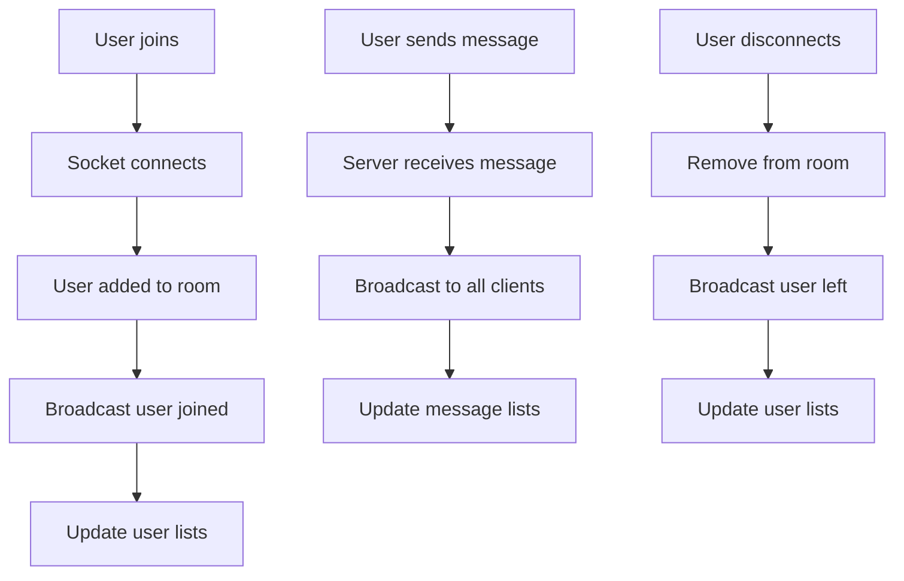

# Real-Time Chat Application

A modern, real-time chat application built with Next.js, TypeScript, Socket.IO, and Tailwind CSS. Features a beautiful dark theme with glass morphism effects, full responsive design, and seamless real-time communication.


## ✨ Features

### 🚀 Core Functionality

-   **Real-time messaging** - Instant message delivery using WebSockets
-   **User authentication** - Simple username-based login system
-   **Online users list** - See who's currently in the chat with live updates
-   **Message history** - View previous messages when joining
-   **System notifications** - Get notified when users join or leave
-   **Message timestamps** - Relative time display (e.g., "2 minutes ago")

### 🎨 Modern UI/UX

-   **Dark theme with glass morphism** - Stunning gradient backgrounds with backdrop blur effects
-   **Professional typography** - Inter font family for crisp, modern text
-   **Gradient animations** - Beautiful blue-to-purple gradients throughout
-   **Smooth transitions** - Hardware-accelerated animations for smooth interactions
-   **Visual feedback** - Hover effects, loading states, and interactive elements

### 📱 Responsive Design

-   **Mobile-first approach** - Optimized for all device sizes
-   **Adaptive navigation** - Slide-out sidebar on mobile with overlay
-   **Touch-friendly** - Proper touch targets and gesture support
-   **Cross-platform** - Works seamlessly on desktop, tablet, and mobile
-   **Progressive enhancement** - Enhanced experience on larger screens

### 🔧 Technical Features

-   **TypeScript safety** - Full type safety across the entire application
-   **Custom server** - Node.js server with integrated Socket.IO
-   **Context state management** - React Context for real-time state
-   **Error handling** - Graceful error handling and loading states
-   **Performance optimized** - Efficient re-renders and smooth scrolling

## 🏗️ System Architecture

### How It Works

#### 1. **Client-Server Communication**

```
Browser ↔ Socket.IO ↔ Custom Node.js Server ↔ Next.js App
```

The application uses a **hybrid architecture** combining Next.js for the frontend with a custom Node.js server for real-time communication:

-   **Frontend**: Next.js 15 with React 19 and TypeScript
-   **Backend**: Custom Node.js server (`server.js`) that integrates:
    -   Next.js request handler for regular HTTP requests
    -   Socket.IO server for real-time WebSocket connections
-   **Communication**: Bidirectional real-time communication via Socket.IO

#### 2. **Real-Time Flow**



#### 3. **State Management**

The application uses **React Context** (`SocketContext`) to manage:

-   Socket connection state
-   Current user information
-   Online users list
-   Message history
-   Connection status

#### 4. **Component Architecture**

```
App (page.tsx)
├── SocketProvider (SocketContext)
│   ├── Login Component (if not authenticated)
│   └── Chat Component (if authenticated)
│       ├── UserList (sidebar with online users)
│       ├── MessageList (message display area)
│       └── MessageInput (message composition)
```

### 🔌 Socket.IO Events

#### Client → Server Events:

-   `join` - User joins chat with username
-   `message` - User sends a message
-   `disconnect` - User leaves chat

#### Server → Client Events:

-   `user-joined` - New user joined notification
-   `user-left` - User left notification
-   `message` - New message received
-   `users-update` - Updated list of online users

### 📊 Data Flow

1. **User Authentication**:

    ```typescript
    User enters username → Socket connects → Server validates → User added to room
    ```

2. **Message Sending**:

    ```typescript
    User types message → Client sends to server → Server broadcasts to all → UI updates
    ```

3. **Real-time Updates**:
    ```typescript
    Server event → Context state update → Component re-render → UI reflects changes
    ```

## 🚀 Tech Stack

### Frontend

-   **Next.js 15** - React framework with App Router
-   **React 19** - Latest React with concurrent features
-   **TypeScript 5** - Static type checking
-   **Tailwind CSS 3** - Utility-first CSS framework
-   **Inter Font** - Modern typography from Google Fonts

### Backend & Real-time

-   **Node.js** - JavaScript runtime
-   **Socket.IO 4** - Real-time bidirectional communication
-   **UUID** - Unique identifier generation
-   **date-fns** - Date formatting and manipulation

### Development

-   **ESLint** - Code linting and formatting
-   **VS Code Tasks** - Development workflow integration

## 🛠️ Getting Started

### Prerequisites

-   Node.js 18+
-   npm or yarn

### Installation

1. **Clone the repository**:

```bash
git clone https://github.com/architjain2/real-time-chat.git
cd real-time-chat
```

2. **Install dependencies**:

```bash
npm install
```

3. **Start the development server**:

```bash
npm run dev
```

4. **Open in browser**:
    - Navigate to [http://localhost:3000](http://localhost:3000)
    - Enter a username to join the chat
    - Start messaging in real-time!

## 💻 Usage Guide

### For Desktop Users:

1. **Join the Chat**: Enter your username and click "Join Chat"
2. **View Online Users**: Users list is visible in the left sidebar
3. **Send Messages**: Type in the input field and press Enter or click Send
4. **See Activity**: Watch real-time notifications when users join/leave

### For Mobile Users:

1. **Join the Chat**: Enter username on the mobile-optimized login screen
2. **Access User List**: Tap the hamburger menu (☰) to see online users
3. **Navigate**: Tap outside the user list to close it
4. **Send Messages**: Use the touch-optimized message input at the bottom

### Message Features:

-   **User Messages**: Your messages appear on the right with gradient backgrounds
-   **Other Messages**: Other users' messages appear on the left with user avatars
-   **System Messages**: Join/leave notifications appear centered
-   **Timestamps**: All messages show relative time (e.g., "2 minutes ago")

## 📁 Project Structure

```
real-time-chat/
├── 📁 public/                     # Static assets
├── 📁 src/
│   ├── 📁 app/
│   │   ├── api/socket/route.ts    # Socket.IO API route (unused)
│   │   ├── layout.tsx             # Root layout with metadata
│   │   ├── page.tsx               # Main application entry point
│   │   └── globals.css            # Global styles and responsive CSS
│   ├── 📁 components/
│   │   ├── Chat.tsx               # Main chat interface with mobile nav
│   │   ├── Login.tsx              # Responsive username login form
│   │   ├── MessageInput.tsx       # Mobile-optimized message input
│   │   ├── MessageList.tsx        # Responsive message display
│   │   └── UserList.tsx           # Responsive users sidebar
│   ├── 📁 contexts/
│   │   └── SocketContext.tsx      # Socket.IO React context provider
│   └── 📁 types/
│       └── chat.ts                # TypeScript interface definitions
├── server.js                      # Custom Node.js + Socket.IO server
├── package.json                   # Dependencies and scripts
└── README.md                      # This file
```

### Key Files Explained:

#### `server.js` - Custom Server

-   Integrates Next.js with Socket.IO
-   Handles both HTTP requests and WebSocket connections
-   Manages user sessions and message broadcasting

#### `src/contexts/SocketContext.tsx` - State Management

-   Provides Socket.IO connection to all components
-   Manages real-time state updates
-   Handles user authentication and message history

#### `src/components/Chat.tsx` - Main Interface

-   Responsive layout with mobile navigation
-   Hamburger menu for mobile users
-   Adaptive header with connection status

#### `src/app/globals.css` - Styling

-   Custom Inter font integration
-   Glass morphism and gradient effects
-   Mobile-first responsive optimizations
-   Custom scrollbar styling

## 🎨 Design System

### Color Palette:

-   **Primary**: Slate-900 to Purple-900 gradient backgrounds
-   **Accents**: Blue-500 to Purple-600 gradients for interactive elements
-   **Text**: White and slate-300 for optimal contrast
-   **Glass Effects**: White/10 with backdrop blur for modern aesthetics

### Typography:

-   **Font Family**: Inter (Google Fonts)
-   **Weights**: 300-900 range for various text hierarchies
-   **Responsive Sizing**: Adaptive font sizes based on screen size

### Responsive Breakpoints:

-   **Mobile**: < 640px (sm)
-   **Tablet**: 640px - 1024px (md/lg)
-   **Desktop**: > 1024px (lg+)

## ⚡ Development

### Available Scripts:

```bash
npm run dev      # Start development server (uses custom server.js)
npm run build    # Build for production
npm run start    # Start production server (uses custom server.js)
npm run lint     # Run ESLint for code quality
```

### Development Workflow:

1. **Hot Reload**: Changes automatically refresh in the browser
2. **TypeScript**: Full type checking during development
3. **Socket.IO**: Real-time updates without page refresh
4. **Responsive Testing**: Use browser dev tools to test mobile layouts

### Environment Configuration:

-   **Default Port**: 3000
-   **Custom Port**: Set `PORT` environment variable
-   **Development**: Automatic compilation and hot reload
-   **Production**: Optimized build with static generation

### VS Code Integration:

The project includes VS Code tasks for easy development:

-   Press `Ctrl+Shift+P` → "Tasks: Run Task" → "Start Development Server"

## 🔧 Customization

### Adding New Features:

1. **New Socket Events**: Add to `server.js` and `SocketContext.tsx`
2. **UI Components**: Create in `src/components/` with TypeScript
3. **Styling**: Use Tailwind classes or extend `globals.css`
4. **Types**: Define in `src/types/chat.ts` for type safety

### Responsive Modifications:

-   Modify breakpoints in component className strings
-   Update mobile navigation in `Chat.tsx`
-   Adjust touch targets in `globals.css`

## 🌐 Deployment

### Production Build:

```bash
npm run build    # Creates optimized production build
npm run start    # Starts production server
```

### Deployment Platforms:

-   **Vercel**: Supports custom servers with configuration
-   **Heroku**: Works out of the box with Node.js buildpack
-   **Digital Ocean**: Deploy on any Node.js-compatible platform
-   **Railway**: Simple deployment with git integration

### Environment Variables:

```bash
PORT=3000                    # Server port (optional)
NODE_ENV=production         # Production mode
```

## 🤝 Contributing

1. Fork the repository
2. Create a feature branch: `git checkout -b feature-amazing-feature`
3. Make your changes with proper TypeScript types
4. Test responsive design on multiple screen sizes
5. Commit changes: `git commit -m 'Add amazing feature'`
6. Push to branch: `git push origin feature-amazing-feature`
7. Open a Pull Request

### Contribution Guidelines:

-   Maintain TypeScript strict mode compliance
-   Follow the existing responsive design patterns
-   Test on both desktop and mobile
-   Update README if adding new features

## 📄 License

This project is licensed under the MIT License - see the [LICENSE](LICENSE) file for details.

## 🙏 Acknowledgments

-   **[Next.js](https://nextjs.org/)** - The React framework for production
-   **[Socket.IO](https://socket.io/)** - Real-time bidirectional event-based communication
-   **[Tailwind CSS](https://tailwindcss.com/)** - Utility-first CSS framework
-   **[Inter Font](https://rsms.me/inter/)** - A typeface carefully crafted for computer screens
-   **[Heroicons](https://heroicons.com/)** - Beautiful hand-crafted SVG icons
-   **[React](https://reactjs.org/)** - A JavaScript library for building user interfaces
-   **[TypeScript](https://www.typescriptlang.org/)** - Typed superset of JavaScript

## 📱 Browser Support

-   **Desktop**: Chrome 90+, Firefox 88+, Safari 14+, Edge 90+
-   **Mobile**: iOS Safari 14+, Chrome Mobile 90+, Samsung Internet 14+
-   **Features**: WebSocket support required for real-time functionality

---

Built with ❤️ using modern web technologies for a seamless real-time chat experience.
